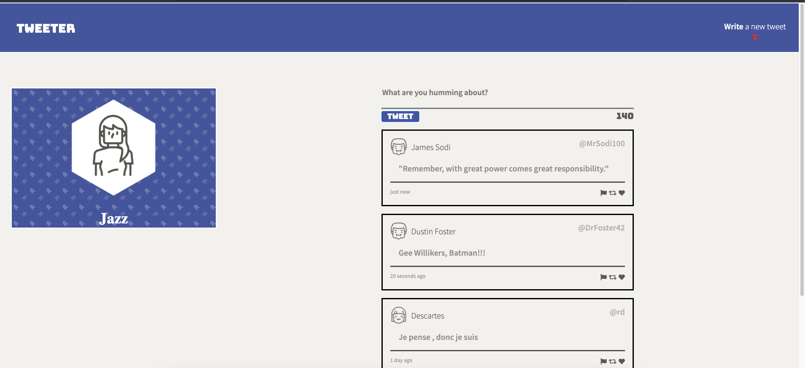
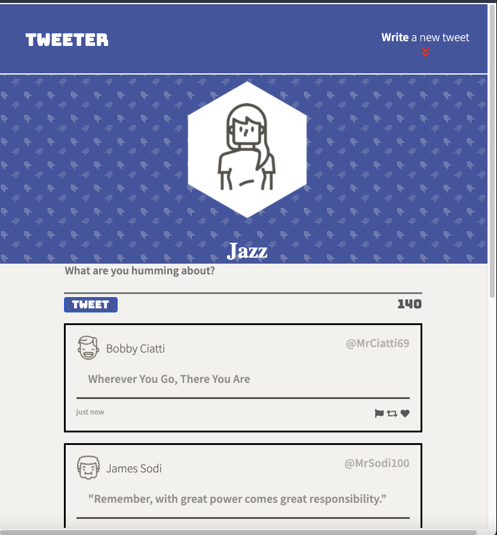
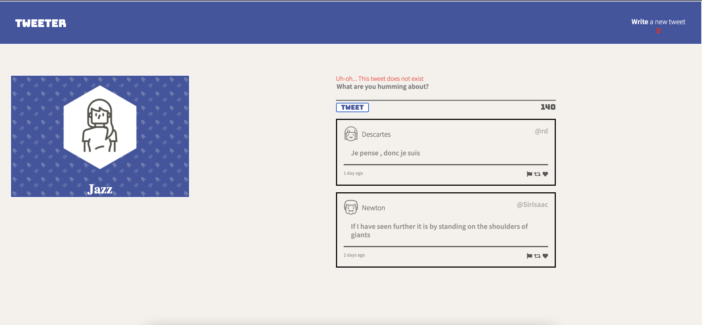
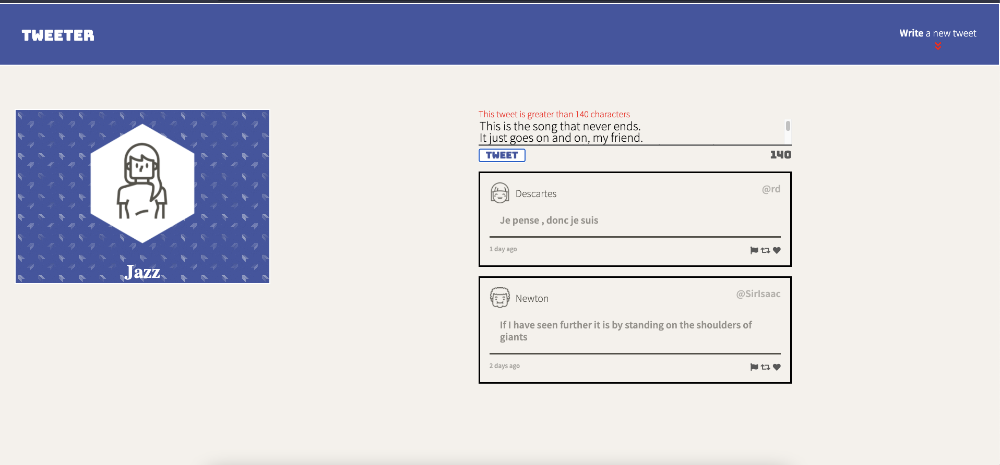

# Tweeter Project

# Tweeter Project

## WELCOME TO MY TWEETER APP !

Tweeter is a simple, single-page Twitter built with JS, Node, jQuery, AJAX, Express, MongoDB, HTML, and CSS !

## Final Product

#### Features
1. Responsive design !
2. No refresh/reload needed !
3. Error messages for tweets too long and non-existing !

## Getting Started

1. Fork this repository, then clone your fork of this repository.
2. Install dependencies using the `npm install` command.
3. Start the web server using the `npm run local` command. The app will be served at <http://localhost:8080/>.
4. Go to <http://localhost:8080/> in your browser.

## Dependencies

- Express
- Node 5.10.x or above
